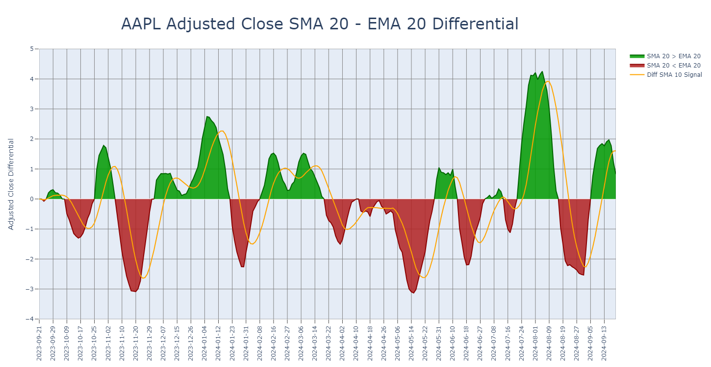

# portfolio_analytics
The main purpose of this project was to create an interactive dashboard offering the user the opportunity to perform technical analysis on a portfolio of custom selected assets. These historical insights would then serve the broader goal of being able to build an optimal portfolio that is expected to perform successfully based on the desired investment objectives.

The **portfolio_analytics** repository contains the Python code designed to perform four major groups of tasks:

**a. Download data**
> - web scrape comprehensive lists of top assets in various categories
> - download ticker information from Yahoo!Finance
> - download historical ticker data from Yahoo!Finance

**b. Analyze prices**
> - statistical summary at the portfolio level
> - drawdown analysis with tabular summaries and an interactive plot of top drawdowns for each ticker
> - interactive line graphs and candlestick plots with traditional and hollow candles
> - moving average convergence divergence (MACD) plot with signal overlay and an optional price overlay for each ticker
> - relative strength index (RSI) plot with overbought and oversold overlays and an optional price overlay for each ticker
> - stochastic oscillator %K-%D plot with overbought and oversold overlays and an optional price overlay for each ticker
> - up to six custom selected moving average overlays on top of an existing graph
> - up to three pairs of customized Bollinger band overlays on top of an existing graph
> - up to three pairs of customized moving average envelope overlays on top of an existing graph
> - price differential plot for two custom selected moving averages or price types with an optional signal line

**c. Analyze returns**
> - summary of statistical properties of asset return distributions
> - heat map plots of various asset correlation metrics
> - principal component analysis with scatter plots for top components and eigenvector overlays

**d. Analyze performance**
> - summaries of performance metrics both for each asset and for the asset-weighted portfolio:
>   - Sharpe ratio
>   - Sortino ratio
>   - probabilistic Sharpe ratio
>   - Treynor's ratio
>   - Jensen's alpha
>   - information ratio
>   - omega ratio
>   - up and down market capture ratios
>   - Amihud liquidity measure
>   - utility function
>   - Calmar ratio
>   - Sterling ratio
>   - Martin ratio

Implementation of tasks pertaining to the last two groups above is still ongoing. Below are some screenshots illustrating the functional capabilities of the current code and of the intended dashboard.

### 1. Statistical Properties of Asset Returns
The summary was prepared for one year of historical log return distributions of the Magnificent Seven stocks. Jarque-Bera test p-values > 0.05 would typically indicate that the given distribution can be considered normal.
> 

### 2. Asset Correlation Heat Map
The heat map plots the Kendall correlation of log returns for the Dow Jones Industrial Average stocks based on one year of historical data. Other correlation metrics that can be plotted in the same way include Pearson correlation, Spearman correlation, the adjusted correlation metric and the cumulative return distance. The last two were proposed by [<ins>Dolphin et al</ins>](https://arxiv.org/pdf/2107.03926) and may, as the authors argue, be more suitable measures of similarity between assets than the traditional correlation metrics. 
> 

> Plotting package: matplotlib, seaborn 
> Color map: seismic (built-in) 
> Interactive: no 

### 3. Hollow Candles With Price Overlays
If you are more used to the traditional candlestick and find the hollow candle plot a bit confusing, the legend explains the meaning of each candle type, plus the Open and Close prices are plotted as overlays (High and Low can also be added, if desired). These overlays can be toggled off/on anytime by clicking on the corresponding line in the legend.
> 

> Plotting package: plotly 
> Theme: dark 
> Overlay color theme: sapphire 
> Interactive: yes 

### 4. Traditional Candles With Moving Average Overlays
In case you prefer a light plot background, you can switch at any time between the dark and light themes. You can also pick and switch between any of 10 pre-defined overlay color themes and/or invert the sequence of colors in them, if desired. In this traditional candlestick plot, a ribbon of six Close-based Simple Moving Average (SMA) overlays have been added with windows increasing in 5-day increments. You can custom-define the window size and the type of each moving average overlay ('simple', 'exponential', 'double exponential', triple exponential' or 'weighted'). 
> 

> Plotting package: plotly 
> Theme: light 
> Overlay color map: lavender 
> Interactive: yes 

### 5. Traditional Candles With Moving Average, Bollinger Band and Moving Average Envelope Overlays
In this plot, traditional candles have been overlaid with a pair of standard (20, 2) Bollinger bands and then with a pair of (20, 10%) envelopes, both over a 20-day Close-based Simple Moving Average (SMA). You can add up to three pairs of Bollinger overlays and up to three pairs of envelopes on one plot, toggling them off/on as desired. Note that, if at any point you attempt to add a line that already exists in the plot, the new duplicate line will be omitted. That is why, although both the set of Bollinger and the set of envelope overlays contain the SMA base line, only the one added first - as can be deduced from its position in the legend - is plotted.
> 

> Plotting package: plotly 
> Theme: dark 
> Bollinger overlay color map: sapphire 
> Envelope overlay color map: turquoise 
> Interactive: yes 

### 6. Adjusted Close With Two Moving Averages and Corresponding Envelope Overlays
Imagine the richness of signals coming from all the line intersections like in this graph... If you can interpret them, that is! :smiley:

Kidding aside, there is almost no limit to how many overlays you can add to a single plot - the maximum of six lines per a single overlay set comes from the limit of colors/shades in each color theme, but you can add multiple sets on top of one another using different color themes! Remember that these plots are interactive, so you can always choose which lines are displayed by toggling them off/on from the legend. 

In this graph, the Adjusted Close daily prices have been overlaid with three pairs of envelopes in 2.5% increments over a 50-day SMA and then with three pairs of envelopes in the same increments over a 10-day SMA. Both sets of overlays are based on Adjusted Close, since that is the base price curve here, but you could have also chosen to plot Close, Open, High, Low, or all of them, if you wished so.
> 

> Plotting package: plotly 
> Theme: dark 
> First envelope overlay color map: gold 
> Second envelope overlay color map: magenta 
> Interactive: yes 

### 7. Moving Average Differential Plot With a Signal Overlay
If the mutual behaviour of any two price or moving average curves raises your special interest, you can plot their difference in a similar way the moving average convergence divergence (MACD) is constructed (see 11. below). If it makes sense in a particular case, you can also add a custom-defined signal line that is a moving average of that very difference - again, similar to the MACD 9-day SMA signal. In this example, the 20-day Simple (SMA) and Exponential (EMA) Moving Averages are compared, with an arbitrary signal of 10-day SMA added. But it could also be a comparison between an EMA and a Weighted Moving Average (WMA) with an EMA signal; or a comparison between two moving averages of different window sizes; or between Open and Close prices, similar to a traditional candlestick plot, to name just a few.
> 

> Plotting package: plotly 
> Theme: light 
> Signal overlay color map: gold 
> Interactive: yes 