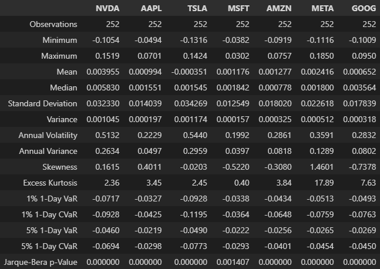

# portfolio_analytics
The main purpose of this project has been to create an interactive dashboard offering the user an opportunity to perform technical analysis of a portfolio of custom selected assets. These historical insights would then serve the broader goal of being able to build an optimal portfolio that is expected to perform successfully based on the desired investment objectives. 

The project is ongoing, although a vast amount of functionality has already been developed. The idea has been to be able to perform these four major groups of tasks:

**a. Download data**
> - web scrape comprehensive lists of top assets in various categories
> - download ticker information from Yahoo!Finance
> - download historical ticker data from Yahoo!Finance

**b. Analyze prices**
> - statistical summary at the portfolio level
> - drawdown analysis with tabular summaries and an interactive plot of top drawdowns
> - interactive line graphs and candlestick plots with traditional and hollow candles
> - moving average convergence divergence (MACD) plot with signal overlay and an optional price overlay
> - relative strength index (RSI) plot with overbought and oversold overlays and an optional price overlay
> - stochastic oscillator %K-%D plot with overbought and oversold overlays and an optional price overlay
> - up to six custom selected moving average overlays on top of an existing graph
> - up to three pairs of customized Bollinger band overlays on top of an existing graph
> - up to three pairs of customized moving average envelope overlays on top of an existing graph
> - price oscillator plot for two custom selected moving averages or price types with an optional signal line

**c. Analyze returns**
> - summary of statistical properties of asset return distributions
> - heat map plots of various asset correlation metrics
> - principal component analysis with scatter plots for top components and eigenvector overlays

**d. Analyze performance**
> - summaries of performance metrics both for each asset and for the asset-weighted portfolio:
>   - Sharpe Ratio
>   - Sortino Ratio
>   - Probabilistic Sharpe Ratio
>   - Treynor's Ratio
>   - Jensen's Alpha
>   - Information Ratio
>   - Omega Ratio
>   - Up and Down Market Capture Ratios
>   - Amihud Liquidity Measure
>   - Utility Function
>   - Calmar Ratio
>   - Sterling Ratio
>   - Martin Ratio

Detailed implementation of the last two groups of tasks is still in progress. 

Below are some screenshots illustrating the functional capabilities of the current code and of the intended dashboard. Click on any of them to enlarge.

### 1. Statistical Properties of Portfolio Asset Returns
The summary was prepared for one year of historical log return distributions of the Magnificent Seven stocks. Jarque-Bera test p-values > 0.05 would typically indicate that the given distribution can be considered normal.
> 

### 2. Asset Correlation Heat Map
The heat map plots the Kendall correlation of log returns for the Dow Jones Industrial Average stocks based on one year of historical data. Other correlation metrics that can be plotted in the same way include Pearson correlation, Spearman correlation, the adjusted correlation metric and the cumulative return distance. The last two were proposed by [<ins>Dolphin et al</ins>](https://arxiv.org/pdf/2107.03926) and may, as the authors argue, be more suitable measures of similarity between assets than the traditional correlation metrics. 
> 

> Plotting package: matplotlib, seaborn 
> Color map: seismic (built-in) 
> Interactive: no 

### 3. Hollow Candlestick With Price Overlays
If you are more used to the traditional candles and find a hollow candelabrum a bit confusing, the legend explains the meaning of each candle type. For additional convenience, the Open and Close prices are plotted as overlays (High and Low can also be added, if desired), which can be toggled off/on anytime by clicking on the corresponding line in the legend.
> 

> Plotting package: plotly 
> Theme: dark 
> Overlay color theme: sapphire 
> Interactive: yes 

### 4. Traditional Candlestick With Moving Average Overlays
In case you prefer a light plot background, you can switch at any time between the dark and light themes. You can also pick and switch between any of the 10 pre-defined overlay color themes and/or invert the sequence of colors, if desired. In this traditional candlestick plot, a ribbon of six Close-based Simple Moving Average (SMA) overlays have been added with windows increasing in 5-day increments. You can custom-define the window size and the type of each moving average overlay ('simple', 'exponential', 'double exponential', triple exponential' or 'weighted'). 
> 

> Plotting package: plotly 
> Theme: light 
> Overlay color map: lavender inverted 
> Interactive: yes 

### 5. Traditional Candlestick With Moving Average, Bollinger Band and Moving Average Envelope Overlays
In this plot, traditional candles have been overlaid with a pair of standard (20, 2) Bollinger bands and then with a pair of (20, 10%) envelopes, both over a 20-day Close-based SMA. You can add up to three pairs of Bollinger overlays and up to three pairs of envelopes on one plot, toggling them off/on as desired. Note that, if at any point you attempt to add a line that already exists in the plot, the new duplicate line will be omitted. That is why, although both the set of Bollinger overlays and the set of envelope overlays contain the 20-day SMA base line, only the one added first - as can be noted from its position in the legend - is plotted.
> 

> Plotting package: plotly 
> Theme: dark 
> Bollinger overlay color map: sapphire 
> Envelope overlay color map: turquoise 
> Interactive: yes 

### 6. Adjusted Close With Two Moving Averages and Corresponding Envelope Overlays
Imagine the richness of signals coming from all the line crossovers in a graph like this...! :smiley:

Kidding aside, there is almost no limit to how many overlays you can add to a single plot - the maximum of six lines per single overlay set comes from the limit of colors/shades in each color theme, but you can add multiple sets on top of one another using different color themes. Remember that these plots are interactive, so you can always choose which lines are displayed by toggling them off/on from the legend. 

In this graph, the Adjusted Close daily prices have been overlaid with three pairs of envelopes in 2.5% increments over a 50-day SMA and then with three pairs of envelopes in the same increments over a 10-day SMA. Both sets of overlays are based on Adjusted Close, since that is the base price curve here, but you could have also chosen to use Close, Open, High or Low as the base instead - or even plot all of them as overlays, if you wished so.
> 

> Plotting package: plotly 
> Theme: dark 
> First envelope overlay color map: gold 
> Second envelope overlay color map: magenta 
> Interactive: yes 

### 7. Moving Average Oscillator Plot With Signal Overlay
If the behaviour of any two price or moving average curves happens to catch your special attention, you can plot their difference in a similar way the moving average convergence divergence (MACD) is constructed (see 11. below). This type of difference is typically referred to as a price oscillator. You can then add a custom-defined signal line that is a moving average of that oscillator - again, similar to the MACD 9-day SMA signal. In this example, the oscillator is constructed as a difference between the 20-day Simple (SMA) and Exponential (EMA) Moving Averages, with an arbitrary signal of a 10-day SMA added. Likewise, you could also use this type of plot to compare an EMA against a Weighted Moving Average (WMA) with an EMA signal; or to compare two moving averages of different window sizes; or to compare Open and Close prices, similar to a traditional candlestick plot - just to name a few possibilities.
> 

> Plotting package: plotly 
> Theme: light 
> Signal overlay color map: gold 
> Interactive: yes 

### 8. Summary of Portfolio Asset Drawdowns
Drawdown analysis is an important part of asset risk assessment for many investors. Two critical aspects of a drawdown, determining the resulting monetary loss, are its depth (peak-to-trough % price decline) and its length (period of time required for an investment to recover). The table below summarizes the drawdowns for a Magnificent Seven portfolio of stocks over one year of historical prices. The table includes a related Ulcer Index, defined as the square root of the mean squared deviation from the maximum price over a specific period of time, which can be the whole historical period or a rolling 14-day. The Ulcer Index is used to calculate Martin Ratio, a performance metric similar to Sharpe Ratio, where it replaces standard deviation in the denominator.
> 

### 9. Summary of Individual Asset Drawdowns
The top drawdowns for each asset of interest can be identified based on either the % depth or length. The table below lists top six drawdowns for one year of historical AAPL prices, sorted by length. This summary has been inspired by an example given in [<ins>W&uuml;rtz et al, p. 35</ins>](https://www.rmetrics.org/downloads/9783906041018-fPortfolio.pdf), and the drawdown computation methodology has been tested on the original data used by the authors.
> 

### 10. Individual Asset Drawdown Plot
This example uses the same AAPL data as above, except the top six drawdowns are selected based on their % depth. The drawdowns are based, and are overlaid, on the Adjusted Close prices (although Close or any other price could also be used). For better clarity, only the peak-to-trough portion of each drawdown is shown, and the lengths in days listed in the legend refer to that phase only; however, the option of displaying the full peak-to-recovery length is also available. The color intensity of each drawdown plotted is proportional to its depth. 
> 

> Plotting package: plotly 
> Theme: dark 
> Overlay color map: red with intensity scaled proportionally to drawdown depth 
> Interactive: yes 

### 11. Individual Asset MACD Plot With Signal and Price Overlays
The moving average convergence divergence (MACD) is one of the most popular technical indicators, defined as the difference between a 12-day EMA and a 26-day EMA. As is normally the case with shorter-vs-longer window moving averages, a positive MACD would be a potential signal to buy, while a negative MACD - a possible signal to sell. This strategy is refined by the addition of the 9-day EMA signal line, indicating a likely upcoming change in the price trend whenever the signal crosses the MACD.  

The MACD bar chart presented here is overlaid with the original Adjusted Close price as labelled on the secondary (right-hand-side) y-axis. By design, you cannot alter the standard window sizes of the MACD EMAs; however, it is possible to explore the effect of the change in the signal window. Note that you can have the full flexibility of devising your own price oscillator similar to MACD along with a custom-designed signal - as mentioned above in example 7.
> 

> Plotting package: plotly 
> Theme: dark 
> Signal overlay color map: gold 
> Interactive: yes 

### 12. Individual Asset RSI Plot With Overbought/Oversold and Price Overlays
The Relative Strength Index (RSI) measures the speed and change of price movements, oscillating between 0 and 100%. RSI values above 70% indicates overbought conditions, while RSI values below 30% indicate oversold conditions, which can be seen by investors as signals to sell or buy, respectively. The default RSI window is 14 days (or time periods, in general), but you can change here it to any other value for exploration purposes. 
> 

> Plotting package: plotly 
> Theme: dark 
> Signal overlay color map: gold 
> Interactive: yes 

### 13. Individual Asset Stochastic Plot With Overbought/Oversold and Price Overlays
In addition to MACD and RSI, many investors favour the Stochastic Oscillator as a technical buy-sell indicator, which - unlike the RSI - is capable of refining the buy-sell signals coming from the overbought/oversold threshold line crossings thanks to the interactions between its two components, the %K and %D lines. Presented in this graph is an example of the full Stochastic Oscillator that uses three adjustable parameters: the 14-day look-back period, the 3-day %K smoothing period, and the 5-day %D averaging period. In the standard formulation, there is fast and a slow version of the Stochastic Oscillator, both of which have the %D averaging period set to 3.
> _PriceOverlay_Dark.png)

> Plotting package: plotly 
> Theme: dark 
> Fast signal overlay color map: gold 
> Slow signal overlay color map: orchid 
> Interactive: yes 

