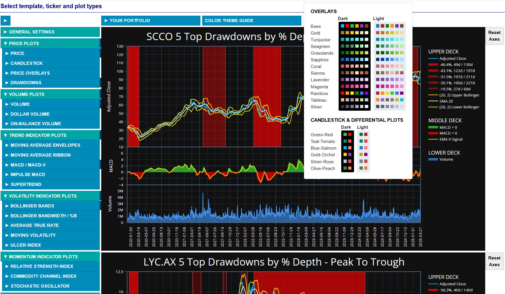

# portfolio_analytics

## **Overview**

The main purpose of this project has been to create an interactive dashboard offering the user an opportunity to perform technical analysis of a portfolio of custom selected assets. These historical insights would then serve the broader goal of being able to build an optimal portfolio that is expected to perform successfully based on the desired investment objectives. 

The five-page technical analysis web app, written in Plotly and Dash, is almost complete - see the screenshots and descriptions in [Examples 20-24 below](#20-technical-analysis-app-page-1). 

In the broader context, most of the analytics functionality has already been developed at the back end. The idea has been to be able to perform these four major groups of tasks:

**a) Download data**
> - web scrape comprehensive lists of top assets in various categories
> - download ticker information from Yahoo!Finance
> - download historical ticker data from Yahoo!Finance

**b) Analyze prices**
> - statistical summary at the portfolio level
> - choice of a single-, double- or triple-deck template, with an optional secondary y-axis in the upper deck, allowing to combine multiple plots on one stacked graph
> - drawdown analysis with tabular summaries at both the portfolio and individual asset levels
> - top drawdowns plot for each asset with depth-dependent color intensity overlays 
> - line graph or candlestick plot - with traditional or hollow candles - of historical prices
> - histogram or (optionally filled) line plot of historical volumes or dollar volumes
> - histogram or filled-line plot of moving average convergence divergence (MACD) / volatility-normalized (MACD-V), with a signal overlay
> - difference (oscillator) plot for two custom selected moving averages or price types or stochastic %K-%D lines, with an optional signal line
> - relative strength index (RSI) plot with overbought and oversold overlays
> - stochastic oscillator %K and %D line plot with overbought and oversold overlays
> - plot or overlay of volatility metrics: moving volatility / standard deviation (MVOL/MSTD), average true rate / percentage (ATR/ATRP), Bollinger band width (B-Width)
> - up to six custom selected moving average overlays on top of an existing graph
> - up to three pairs of customized Bollinger band overlays on top of an existing graph
> - up to three pairs of customized moving average envelope overlays on top of an existing graph

**c) Analyze returns**
> - summary of statistical properties of asset return distributions
> - heat map plots of various asset correlation metrics
> - principal component analysis with scatter plots for top components and eigenvector overlays

**d) Analyze performance**
> - summaries of performance metrics for each asset and for the asset-weighted portfolio:
> - Sharpe Ratio
> - Sortino Ratio
> - Probabilistic Sharpe Ratio
> - Treynor's Ratio
> - Jensen's Alpha
> - Information Ratio
> - Omega Ratio
> - Up and Down Market Capture Ratios
> - Amihud Liquidity Measure
> - Utility Function
> - Calmar Ratio
> - Sterling Ratio
> - Martin Ratio

Detailed implementation of the c) and d) groups of tasks is still in progress. 

## **Examples**

Below are some screenshots illustrating the functional capabilities of the current code and of the intended dashboard. Click on any of them to enlarge. 

All plotly graphs are in reality interactive, i.e. 
> - they can be zoomed in/out, panned and rescaled
> - the co-ordinates and label of every trace (plotted object) are displayed on mouse hover
> - the display of each trace can be switched on/off by clicking on the corresponding symbol in the legend

### 1. Statistical Properties of Portfolio Asset Returns
The summary was prepared for one year of historical log return distributions of the Magnificent Seven stocks. Jarque-Bera test p-values > 0.05 would typically indicate that the given distribution can be considered normal.
> 

### 2. Asset Correlation Heat Map
This heat map plots the Kendall correlation of log returns for the Dow Jones Industrial Average stocks based on one year of historical data. Other correlation metrics that can be plotted in the same way include Pearson correlation, Spearman correlation, the adjusted correlation metric and the cumulative return distance. The last two were proposed by [<ins>Dolphin et al</ins>](https://arxiv.org/pdf/2107.03926) and may, as the authors argue, be more suitable measures of similarity between assets than the traditional correlation metrics. 
> 

> Plotting package: matplotlib, seaborn 
> Color map: seismic (built-in) 
> Interactive: no 

### 3. PCA Scatter Plot With Eigenvector 
The Principal Component Analysis can give you additional insights into your portfolio's assets similarity. Plotted here is a simple example how this can be visualized. The scatter plot compares the fourth vs. the third principal component, and the arrows illustrate the directions and magnitudes of the relevant eigenvectors, corresponding to the original portfolio assets.
> 

> Plotting package: matplotlib 
> Interactive: no 

### 4. Hollow Candles With Price Overlays
If you are more used to the traditional candles and find hollow candelabra a bit confusing, the legend in this graph explains the meaning of each candle type. For additional convenience, the Open and Close prices are plotted as overlays (High and Low can also be added, if desired), which can be toggled off/on anytime by clicking on the corresponding line in the legend.
> 

> Plotting package: plotly 
> Theme: dark 
> Plot type: green-red hollow candles 
> Overlay color theme: sapphire 
> Interactive: yes 

### 5. Traditional Candles With Moving Average Overlays
In case you prefer a light plot background, you can switch at any time between the dark and light themes. You can also pick and switch between any of the 12 pre-defined overlay color themes and/or invert the sequence of colors, if desired. In this traditional candlestick plot, a ribbon of six Close-based Simple Moving Average (SMA) overlays have been added with windows increasing in 5-day increments. You can custom-define the window size and choose one of several moving average types. 
> 

> Plotting package: plotly 
> Theme: light 
> Plot type: green-red traditional candles 
> Overlay color theme: lavender inverted 
> Interactive: yes 

### 6. Traditional Candles With Moving Average, Bollinger Band and Moving Average Envelope Overlays
In this plot, traditional candles have been overlaid with a pair of standard (20, 2) Bollinger bands and then with a pair of (20, 10%) envelopes, both over a 20-day Close-based SMA. You can add up to three pairs of Bollinger overlays and up to three pairs of envelopes on one plot, toggling them off/on as desired. Note that, if at any point you attempt to add a line that already exists in the plot, the new duplicate line will be omitted. That is why, although both the set of Bollinger overlays and the set of envelope overlays contain the 20-day SMA base line, only the one added first - as can be noted from its position in the legend - is plotted.
> 

> Plotting package: plotly 
> Theme: dark 
> Plot type: green-red traditional candles 
> Bollinger overlay color theme: sapphire 
> Envelope overlay color theme: turquoise 
> Interactive: yes 

### 7. Price With Multiple Moving Averages and Envelope Overlays
Imagine the richness of signals coming from all the line crossovers in a graph like this... If you can interpret them properly, that is! :smiley:

Kidding aside, there is almost no limit to how many overlays you can add to a single plot. Remember that these plots are interactive, so you can always choose which lines are displayed by toggling them off/on from the legend. 

In this graph, the Adjusted Close daily prices have been overlaid with three pairs of envelopes in 2.5% increments over a 50-day SMA and then with three pairs of envelopes in the same increments over a 10-day SMA. Both sets of overlays are based on Adjusted Close, since that is the base price curve here, but you could have also chosen to use Close, Open, High or Low as the base instead - or even plot all of them as overlays, if you wished so.
> 

> Plotting package: plotly 
> Theme: dark 
> Price line color: tableau blue 
> First envelope overlay color theme: gold 
> Second envelope overlay color theme: magenta 
> Interactive: yes 

### 8. Moving Average Oscillator With Signal Overlay
If any price or moving average curves happen to catch your particular attention, you can plot their difference in a similar way the moving average convergence divergence (MACD) is constructed (see 12. below). This type of difference is typically referred to as a price oscillator. If desired, you can then add a custom-defined signal line that is a moving average of that oscillator - again, similar to the MACD 9-day SMA signal. 

In this example, the oscillator is constructed as a difference between the 20-day Simple (SMA) and Exponential (EMA) Moving Averages, with an arbitrary signal of a 10-day SMA added. Likewise, you could also use this type of plot to compare an EMA against a Weighted Moving Average (WMA) with an EMA signal; or to compare two moving averages of different window sizes; or to compare Open and Close prices, similar to a traditional candlestick plot - just to name a few possibilities.
> 

> Plotting package: plotly 
> Theme: light 
> Oscillator plot type: green-red filled line 
> Signal overlay color: gold 
> Interactive: yes 

### 9. Summary of Portfolio Asset Drawdowns
Drawdown analysis is an important part of asset risk assessment for many investors. Two critical aspects of a drawdown, determining the resulting monetary loss, are its depth (peak-to-trough % price decline) and its length (period of time required for an investment to recover). The table below summarizes the drawdowns for a Magnificent Seven portfolio of stocks over one year of historical prices.

The table includes a related Ulcer Index, defined as the square root of the mean squared deviation from the maximum price over a specific period of time, which can be the whole historical period or a rolling 14-day. The Ulcer Index is used to calculate Martin Ratio, a performance metric similar to Sharpe Ratio, where it replaces standard deviation in the denominator.
> 

### 10. Summary of Individual Asset Drawdowns
The top drawdowns for each asset of interest can be identified based on either % depth or length. The table below lists top six drawdowns for one year of historical AAPL prices, sorted by length. This summary has been inspired by an example given in [<ins>W&uuml;rtz et al, p. 35</ins>](https://www.rmetrics.org/downloads/9783906041018-fPortfolio.pdf), and the drawdown computation methodology has been tested on the original data used by the authors.
> 

### 11. Plot of Individual Asset Drawdowns
This example uses the same AAPL data as above, except the top six drawdowns are selected based on their % depth. The drawdowns are based, and are overlaid, on the Adjusted Close prices (although Close or any other price could also be used). For better clarity, only the peak-to-trough portion of each drawdown is shown, and the lengths in days listed in the legend refer to that phase only; however, the option of displaying the full peak-to-recovery length is also available. The color intensity of each drawdown plotted is proportional to its depth. 
> 

> Plotting package: plotly 
> Theme: dark 
> Price line color: tableau blue 
> Overlay color map: red with intensity scaled proportionally to drawdown depth 
> Interactive: yes 

### 12. Individual Asset MACD With Signal and Price Overlays
The moving average convergence divergence (MACD) is one of the most popular technical indicators, defined as the difference between a 12-day EMA and a 26-day EMA. As is normally the case with shorter-vs-longer window moving averages, a positive MACD would be a potential signal to buy, while a negative MACD - a possible signal to sell. This strategy is refined by the addition of the 9-day EMA signal line, indicating a likely upcoming change in the price trend whenever the signal crosses the MACD.  

The MACD bar chart presented here is overlaid with the original Close price as labelled on the secondary (right-hand-side) y-axis. By design, you cannot alter the standard window sizes of the MACD EMAs; however, it is possible to explore the effect of the change in the signal window. Note that you can have the full flexibility of devising your own price oscillator similar to MACD along with a custom-designed signal - as mentioned above in example 7.
> 

> Plotting package: plotly 
> Theme: dark 
> MACD plot type: green-red histogram 
> Signal overlay color: gold 
> Price overlay color: tableau blue 
> Interactive: yes 

### 13. Individual Asset RSI With Overbought/Oversold and Price Overlays
The Relative Strength Index (RSI) measures the speed and change of price movements, oscillating between 0 and 100%. RSI values above 70% indicates overbought conditions, while RSI values below 30% indicate oversold conditions, which can be seen by investors as signals to sell or buy, respectively. The default RSI window is 14 days (or time periods, in general), but you can change here it to any other value for exploration purposes. The optional Close price overlay is shown, as well.
> 

> Plotting package: plotly 
> Theme: dark 
> Signal overlay color: gold 
> Price overlay color: tableau blue 
> Interactive: yes 

### 14. Individual Asset Stochastic With Overbought/Oversold and Price Overlays
In addition to MACD and RSI, many investors favour the Stochastic Oscillator as a technical buy-sell indicator. Unlike the RSI, the Stochastic is capable of refining the buy-sell signals coming from the overbought/oversold threshold line crossings thanks to the interactions between its two components, the %K and %D lines. 

Presented in this graph is an example of the full Stochastic Oscillator that uses three adjustable parameters: the 14-day look-back period, the 3-day %K smoothing period, and the 5-day %D averaging period. In its standard formulation, the Stochastic Oscillator has a fast and a slow version, with the %D averaging period set to 3 in both of them. The optional Close price overlay is shown, as well.
> _PriceOverlay_Dark.png)

> Plotting package: plotly 
> Theme: dark 
> Fast line overlay color: orange 
> Slow line overlay color: darkorchid 
> Price overlay color: tableau blue 
> Interactive: yes 

### 15. Hollow Candles With Price and Moving Average Envelope Overlays (Upper) and Volume (Lower)
It is often desirable to view how another metric, with a different range of values, changes alongside the major indicators of interest. 
The graph below is an example where the trade volume is plotted as a histogram below the main graph displaying candles plus overlays.

> 

> Plotting package: plotly 
> Theme: dark 
> Template type: double-deck 
> Upper deck plot type: green-red hollow candles 
> Upper deck price overlay color theme: turquoise 
> Upper deck envelope overlay color theme: gold 
> Lower deck volume color theme: sapphire 
> Interactive: yes 

### 16. Traditional Candles With Bollinger Overlays (Upper), MACD Filled Line With Signal (Middle) and MACD-V Histogram (Lower)
Volatility-normalized MACD, or MACD-V, has been proposed as an indicator that overcomes some limitations of the traditional MACD; for example, by being comparable across markets and across time, or by providing improved signal accuracy. The normalization metric of volatility is the Average True Range (ATR), a concept developed by J. Welles Wilder and based on the type of moving average named after him. The difference between MACD-V and its signal, also know as the MACD-V histogram, is plotted here in the lower deck of the graph below. Both the original MACD-V and signal lines can also be displayed (similarly to lower deck of 17. below) but have been omitted here in order to improve the vertical resolution of the histogram plot.

For comparison with the MACD-V histogram in the lower deck, the middle deck shows the traditional MACD as a zero-crossover green-red filled line along with its standard signal line. The upper deck presents traditional candles overlaid with Bollinger bands, which are also a volatility-related construct. 

> 

> Plotting package: plotly 
> Theme: light 
> Template type: triple-deck 
> Upper deck plot type: green-red traditional candles 
> Upper deck Bollinger overlay color theme: sapphire 
> Middle deck MACD plot type: green-red filled line 
> Middle deck signal overlay color: gold 
> Lower deck MACD-V plot type: green-red histogram 
> Interactive: yes 

### 17. Traditional Candles With EMA Overlays (Upper), Stochastic (Middle) and MACD Histogram (Lower)
This combination of indicators - candles, EMA 200, Stochastic %K and %D lines with overbought/oversold overlays, and MACD Histogram with the EMA 9 signal - is used in one of the actual trading startegies. A buy signal is generated when the price is above EMA 200, and Stochastic is in the oversold range, and MACD changes sign to positive. A sell signal arises when the price is below EMA 200, and Stochastic is in the overbought range, and MACD changes sign to negative.

> 

> Plotting package: plotly 
> Theme: dark 
> Template type: triple-deck 
> Upper deck plot type: green-red traditional candles 
> Upper deck EMA overlay color theme: sapphire 
> Middle deck stochastic fast line color: orange 
> Middle deck stochastic slow line color: darkorchid 
> Lower deck MACD plot type: green-red histogram 
> Lower deck MACD line color: tableau blue 
> Lower deck signal color: gold 
> Interactive: yes 

### 18. Top Drawdowns With SMA Overlays (Upper), Bollinger Width and Moving STD (Middle) and Stochastic K-D Difference With Signal (Lower)
The main plot in the upper deck is similar to 11. above except the five top drawdowns by % depth are displayed in their full length from the initial peak to recovery. The drawdowns are based on and are overlaid with the Close price. As in 11. above, the drawdown color intensity is proportional to the % depth. Additional overlays are SMA lines in 10-day window increments.

The middle deck plots two volatility-related metrics: the one-standard-deviation 20-day Bollinger width (B-Width) and the 10-day moving standard deviation (MSTD). You can notice shifts in the peaks and other features of the two curves due to the difference in the moving average windows.

The lower deck plots the difference of standard (14,3) slow stochastic %K and %D lines, with an arbitrary 7-day SMA signal overlay. Note that the signal line can only provide any additional and meaningful information if its window is smaller than the stochastic's look-back (fast %K) period.

> 

> Plotting package: plotly 
> Theme: light 
> Template type: triple-deck 
> Upper deck plot type: drawdowns with Close price overlay 
> Upper deck color theme: base 
> Upper deck SMA overlay color theme: grasslands 
> Middle deck Bollinger Width color theme: magenta 
> Middle deck Moving STD color theme: lavender 
> Lower deck plot type: green-red K-D difference 
> Lower deck signal color: gold 
> Interactive: yes 

### 19. Top Drawdowns With SMA and Bollinger Overlays (Upper), Volume (Middle) and Stochastic K-D Difference With Signal (Lower)
A preliminary look at the app in Dash. The limited test menu can be collapsed/expanded using the up/down arrow button at upper left. 
> 

### 20. Technical Analysis App Page 1
> On this page, the user can mark categories of interest, for which lists of tickers and the corresponding names will be downloaded. Stock lists will be sorted by Market Capitalization, ETF lists by Assets Under Management, and Futures lists by Open Interest. On-hover popovers display category info such as the number of tickers, examples by name and the source of the list.

> 

### 21. Technical Analysis App Page 2
> On this page, the user can choose tickers for which more detailed info will be downloaded, including the range of dates when the historical data is available.

> 

### 22. Technical Analysis App Page 3
> On this page, the user can refine the selection if tickers, taking into account the start and end dates of available historical data for each of them. Portfolio summary with on-hover popover info for each added ticker appears at the top of the page. There is also an input box for any Yahoo Finance valid ticker that the user may wish to add without referring to any particular category. The selected tickers are displayed in the YOUR PORTFOLIO box, with all ticker details from the selection tables below being displayed on mouse hover. 

> 

### 23. Technical Analysis App Page 4
> On this page, the user can select the common range of dates for the selected portfolio. If the selected range turns out to be wider than the span of available data for any of the tickers, the range will be automatically adjusted. The user can also remove from the portfolio a ticker which lacks sufficiently long period of historical data.

> 

### 24. Technical Analysis App Page 5
> On this page, the user can specify the graph template, choose tickers to be plotted individually on each of them, and select from multiple plot types grouped into several categories:
> - Price Plots
> - Volume Plots
> - Trend Indicator Plots
> - Volatility Indicator Plots
> - Momentum Indicator Plots
> - Differential Plots

> 
> 
